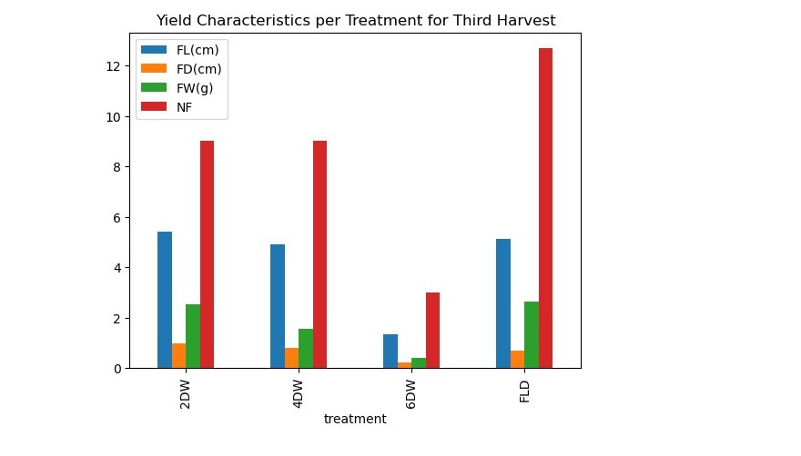

# Response of Cayenne Pepper Growth to Different Water Regimes in Abeokuta

Department of Water Resources Management and Agricultural Meteorology, 
College of Environmental Resources Management

Federal University of Agriculture, Abeokuta, Ogun state, Nigeria.

*Author: Udechukwu Jerry Chinedu*
*Supervisor: Dr. A. A. Makinde* 

`August, 2021`

## ABSTRACT	
Climate change has brought about a frightening new aspect to the already existing challenge of global food security, resulting in food scarcity due to water shortage, especially in improvised countries. Consequently, the need for effective irrigation scheduling to enhance yield, particularly in the pepper industry, has become essential. Thus, the growth and water use pattern of Cayenne pepper were evaluated under various water regimes. The study was carried out at the Federal University of Agriculture, Abeokuta (FUNAAB), in a screen house behind the College of Environmental Resources Management (COLERM). The main aim was to investigate the impact of different water regimes o the growth parameters and yield characteristics of Cayenne pepper in Abeokuta. The experimental design employed was the Completely Randomized Design (CRD) with four treatments and three replicates (4 x 3), where treatments were randomly assigned to subjects. The Cayenne peppers that were underwent individual treatments, with different water regimes as follows: FLD - wetting every day, 2DW- wetting every two days, 4DW - wetting every four days, 6DW - wetting every six days. The findings indicated that Cayenne pepper exhibited varying responses to different water regimes. Regularly monitored agronomic parameters included the average: plant height, number of leaves and leaf area, and the meteorological parameters observed in the screen house environment were air temperature and soil temperature (at depth 5cm and 10cm), relative humidity and light intensity. The results were subjected to statistical analysis. The total yield values in all treatments were 122, 66, 34 and 14 in FLD, 2DW, 4DW and 6DW respectively, indicating that FLD performed better in terms of total yield. The number of leaf mean values gradually increase along the weeks, there were significant increase in Cayenne pepper number of leaf across all treatment. 1WAT had mean values ranging at 11.67 in 2DW, 9.67 in 6DW and 8.67 in FLD slightly more than 8.33 in 4DW. Finally, at 10WAT the mean values ranged from 228.00 in FLD, 187 in 4DW, 152.33 in 2DW and the least was 78.67 in 6DW. The study showed that water use patterns had a significant impact on crop output (yield characteristics) and growth characteristics. The best performance was observed under FLD and 2DW compared to 4DW and 6DW. Hence, it is recommended to use a  combination of water regimes at different strategic point as a good water management practice for the production of Cayenne pepper.
*Key words: water regime, yield characteristic, agronomic characteristics, water management practice, climate change.*

## INTRODUCTION
Water required by crops is supplied by nature in the form of precipitation, but when it becomes scarce or its distribution does not coincide with demand peaks, it is then necessary to supply it artificially, by irrigation. A major reason for the low and erratic rate of growth in agricultural production is the highly uncertain and unpredictable rainfall, combined with low soil fertility (FAO, 2003). At the turn of the millennium, Africa is confronted with a number of major socioeconomic issues that require immediate attention if current trends toward endemic poverty and widespread underdevelopment are to be reversed. The crucial role of water in accomplishing the needed socio-economic development goals is widely recognized. Water, on the surface, should not be a barrier to such development, as Africa looks to have ample water resources. It has large rivers, big lakes; vast water lands and limited, but widespread ground water resources. Unfortunately, however, the sustainability of these water resources cannot be taken for granted for it is threatened by certain natural phenomena and human factors.
Pepper is a vital commercial crop, cultivated for vegetable, spice, and value-added processed products (Kumar and Rai, 2005). Besides vitamins A and C, the fruits contain mixtures of antioxidants notably carotenoids, ascorbic acid, flavonoids and polyphenols (Nadeem et al 2019). This makes it a very important constituent of many foods, adding flavor, color and pungency and, hence, an important source of nutrition for humans. Peppers can be used whale, chopped or m various processed forms such as fresh, dried and ground into powder (with or without the seeds), or as an extract. In most advanced countries, the fresh fruits can be processed into paste and bottled for sale in supermarkets. Cayenne pepper, being a very rich source of vitamins A, C, B6, folic acid and beta-carotene, provides excellent nutrition for humans (Nadeem et al., 2011).  Antioxidant compounds present in the different colors (green, yellow, orange, and red) in sweet bell peppers give them an antioxidative potential, which helps protect the body from oxidative damage induced by free radicals when consumed. This reduces the risk of cardiovascular diseases, asthma, sore throat, headache and diabetes.  
Agricultural productivity has to measure up to those countries that are presently rated as economic giant of the world.  Hence, the agricultural sector of our economy will need a new and effective technology with ideas that will continually improve the productivity, profitability and sustainability of our country major farming practices (Sanusi, 2010: Plumecocq el al., 2018).  One of the greatest setbacks in vegetable production in Nigeria is water shortage during the dry season, as well as farmers' inability to accurately predict the amount of water necessary during the growing season. In light of this, the research looked into the reaction of Cayenne pepper to various water regimes, as weather patterns are unpredictable.

## MATERIAL AND METHODS
### Description of study area 
The experiment described in this study was conducted in a screen house at Federal University of Agriculture, Abeokuta (FUNAAB) beside the meteorological station. The study area is situated between Latitude 7° 13' 30''N and 7° 19' 00''N, Longitude 3˚ 20ˊ15ʺE and 3° 20' 15''N.  The area is has a tropical climate with distinct wet and dry seasons. During the wet season, the area is influenced by moist maritime southerly monsoon winds from the Atlantic Ocean, while the dry season is characterized by continental North Easterly harmattan winds from the Sahara Desert. The region experiences bimodal rainfall patterns, with the wettest months being April to July, followed by August to October. The annual rainfall in Abeokuta and it’s environ ranges between 1400 and 1500mm. The onset of the dry season typically begins in mid-March and reaches its peak in July, with a short break in August. The dry season typically lasts from October to March and is associated with hot weather. The screen house used in the study measures 12m by 4.1m by 2.2m (Length x width x height).

**`Figure 1:` Location of the Experimental site in Federal University of Agriculture, Abeokuta within Odeda local government area in Ogun State, Nigeria**

### Experimental Procedures
#### Cayenne Pepper Nursery
Cayenne pepper plants need warm and sunny environment to thrive. I used a spot in my backyard with plenty of sun light throughout the day. I gathered 12 potable water sachets, perforated them at the bottom to enable filtration, I went on to fill the sachets with a mix of soil, compost and sand to improve drainage. To each sachet containing soil, I planted Cayenne pepper seed in them. I used drip irrigation system to wet the plants daily for 2 weeks.

**`Figure 2:` Showing Emerging Seedlings**

#### Transplanting
Twelve (12) transparent plastic buckets (5litres each), were purchased for the purpose of this experiment. Each of these buckets was perforated at the bottom using soldering iron to enable infiltration of water through the soil out of the bucket. The top soils that filled into the buckets were obtained from the Fadama experimental site behind marble hostel, FUNAAB. These top soils were excavated from the ground by shovel, and then filtered by the use of a sieve to obtain fine top soils that have little or no clump of soil particles before been transferred to the perforated buckets. The perforated buckets containing top soil were wetted with water to field capacity and were left for a day before the desired variety of Cayenne pepper was transplanted. The perforated buckets containing the top soils were then labelled based on the treatments they underwent. The buckets were spaced 1m by 1m apart.

### Experimental Design and Pot Layout.
The experimental design used was the Completely Randomized Design (CRD) with three replications. The Completely Randomized Block Design is the most commonly used design because it minimizes error to a large extent. It is used when we have more than one factor. 

**Table 1: Experimental Design Layout**
REP1|REP2|REP3  
----|----|----
FLD |4DW |6WD
2DW |6DW |FLD
4DW |FLD |2DW
6DW |2DW |4DW

Where:
`FLD`- wetting every day, `2DW` - wetting every 2days, `4DW`- wetting every 4days, `6DW`- wetting every 6days

**`Figure 3:` Experimental Layout**

Data collection and analysis
Three sets of data were collected;
1.	The meteorological data involves weekly observation of relative humidity (%), air temperature (C), light intensity (cd) and soil temperature (C).
2.	The agronomic data: the data collected using standard procedure are, plant height, number of leaves, leaf area (leaf length by breadth).
3.	The yield data; the number of fruits per plant, weight of fruits, length and diameter of fruits.
The data collected were subjected to analysis of variance (ANOVA) to evaluate the effects of different water regimes on the growth of Cayenne pepper variety and treatment means were separated using Least Significant Difference (LSD).

#### Measurements
Different parameters were observed and measured during the experiment, namely;
* Soil temperature: the soil temperature of each treatment was measured weekly at 5cm and 10cm depth simultaneously using soil thermometer.  
* Meteorological parameters within the screen house: average relative humidity and air temperature were measured using a mini weather station. Also the average light intensity was measured using light intensity meter.  
* Growth characteristics: the plants’ height, leaf area, were measured using measuring tape. 
* Yield characteristics: the fruit length was measured using a measuring tape, fruit weight was measured using sensitive scale and the fruit diameter was measured using Vernier caliper

## RESULTS AND DISCUSSION
### Meteorological data collected

**`Figure 4:` Meteorological Data** 

*Keys:* `T`- Temperature (C), `RH`- relative humidity (%), `LI`- Light intensity (cd), `WAT`- weeks after transplanting

`Figure 4:` shows the meteorological data collected during the growing season of Cayenne pepper. The temperature was highest at `6WAT` with 37C and was as low as 30C in both `1WAT` and `9WAT` as the growing period started during the wet season.
* there is a strong negative correlation betweeen Relative humidity and Temperature. As `T` increases `RH` decreases
* there is a strong positive correlation between Light intensity and Temperature. Hence as `LI` increases, so does `T`

### Soil temperature

**`Figure 5:` Soil Temperature at 5cm**

*Keys:* `TRT`- treatment,`FLD`- flooding (wetting everyday), `2DW`- wetting every 2days, `4DW`- wetting every 4days, `6DW`- wetting every 6days,

**Average soil temperature at 5cm depth in degree Celsius:** the weekly observation of soil temperature at 5cm depth of all treatments are shown in `Figure 5`. 
* Treatment `FLD` had its average soil temperature at 5cm depth range from 32.3C to 24.5C.
* `2DW` had its average soil temperature at 5cm depth range from 32.5cm to 24.8cm
* `4DW`ranged from 32.7C to 24.7C and `6DW` had its average soil temperature at 5cm depth range from 32.8C to 28.8C.

**`Figure 6:` Soil Temperature at 10cm**

*Keys:* `TRT`- treatment,`FLD`- flooding (wetting everyday), `2DW`- wetting every 2days, `4DW`- wetting every 4days, `6DW`- wetting every 6days

**Average soil temperature at 10cm depth in degree Celsius:** soil temperature at 10cm depth of all treatments as shown in `Figure 6` was observed simultaneous as at 5cm depth.  
* Treatment `FLD` had its average soil temperature at 10cm depth range from 31.3C to 24.8C
* `2DW` had its average soil temperature at 10cm depth range from 31.8C to 25C
* `4DW` ranged from 32.5C to 24.8C and `6DW` had its average soil temperature at 10cm depth range from 32.8C to 24.6C.

## Growth Characteristics

**`Figure 7:` Effect of Different Water Regimes on the Plant Height of Cayenne Pepper**

*Keys:* `TRT`- treatment,`FLD`- flooding (wetting everyday), `2DW`- wetting every 2days, `4DW`- wetting every 4days, `6DW`- wetting every 6days

**Average Plant height:** `Figure 7` illustrates the effect of different water regimes `TRT` on the height of Cayenne pepper;  
* It can be observed that the average plant height on all treatment gradually increased. The plant height at 1WAT ranges from 9.67cm in both `FLD` and `6DW`, 11.33cm in `4DW` and 18cm in `2DW`
* Equally, the plant height at `5WAT` has mean values ranging from 18.37cm in `6DW`, 25.50cm in `4DW`, 34.67cm in `FLD` and 38.00cm in `2DW`
* Furthermore, at `7WAT`, the mean values are 25.33cm in `6DW`, 30.33cm in `4DW` followed by 43.67cm in `FLD` and having 51.50cm in `2DW` as the highest. 
* Finally, at `10WAT`, the least mean value was 35.00cm in `6DW`, followed by 47.33cm in `4DW`, followed by 59.33cm in `FLD` and the highest was 69.33cm in `2DW`. 
* Based on the average plant height, it can be deduced that Cayenne pepper thrives best in terms of plant height under the water regime `TRT` of `2DW` and `6DW` had the least growth.

 Constant saturation and over saturation reduces crop growth and development especially for a crop like pepper that does not require too much water. It also promotes emission of Green House Gas (GHG), especially carbon dioxide, methane gas and nitrous oxide, one of the factors in climate change that increases global warming. The emission of GHG has been reported to be responsible for over 80% of enhanced global warming (Pathak. et al., 2005).

**`Figure 8:` Effect of Different Water Regimes on the Number of Leaves of Cayenne Pepper**

*Keys:* `TRT`- treatment,`FLD`- flooding (wetting everyday), `2DW`- wetting every 2days, `4DW`- wetting every 4days, `6DW`- wetting every 6days

**Average number of leaves:** The average number of leaves shown in the `Figure 8` indicates that significant effect of different water regimes `TRT` on Cayenne pepper. 
* Treatment `6DW` had its average number of leaves range from 10 to 79
* Treatment `2DW` had its range from 12 to 152, `4DW` had its range from 8 to 187 while `FLD` had 9 to 228

Under well-watered conditions, photosynthesis with chlorophyll brings out the lush green and radiant coloration of leaves and its width is a function of nutrients and water availability for uptake from the root zones (Akinbile, 2010). 

**`Figure 9:` Effect of Different Water Regimes on the Number of Leaves of Cayenne Pepper**

*Keys:* `TRT`- treatment,`FLD`- flooding (wetting everyday), `2DW`- wetting every 2days, `4DW`- wetting every 4days, `6DW`- wetting every 6days

**Average Leaf Area:** there was a significant but gradual increase in leaf area in all treatment (unit; centimeter square). 
* `Figure 9` shows that treatment `2DW` had the highest leaf area.
* Treatment `2DW` had its average leaf area range from 9 to 46. 
* Treatment `FLD` had its average leaf area range from 5 to 32
* `4DW` had its range from 4 to 22 while `6DW` had the least average leaf area, which range from 5 to 19.

Drought condition lead to excess salts premature in older leaves consequently leaf senescence occurr and photosynthetic leaf area of a plant resultantly decrease (Yang et al., 2008).

## Comparative Analysis of Yield Characteristics per Harvest of all Treatments
Cayenne pepper yield: the harvesting of Cayenne pepper begun `9WAT` and was done on a weekly basis for 3 weeks resulting in three harvest. The fruits of each treatment was harvested, measured, and weighed separately. The average yield characteristics (number of fruits, fruit length, fruit diameter, fruit weight) of all treatments were determined and compared to each other from other treatments. 

### First Harvest

**`Figure 10:` Effect of Different Water Regimes on Yield Characteristics of Cayenne Pepper for First Harvest**

*Keys:*
`FD`- fruit diameter, `FL`- fruit lenght, `FW`- fruit weight, `NF`- number of fruits, `TRT`- treatments, `FLD`- flooding(wetting everyday), `2DW`- wetting every 2days, `4DW`- wetting every 4days, `6DW`- wetting every 6days

 `Figure 10` shows comparison of the yield characteristics of the first harvest of all treatment at `9WAT`.
* It can be seen that treatment `4DW` produced no fruit at `9WAT`.
* The average fruit diameter range from 1.00cm in `FLD` was the highest, closely followed by 0.83cm in `2DW` and 0.37 in `6DW` was the least. 
* The average fruit diameter range from 1.00cm in `FLD` was the highest, closely followed by 0.83cm in `2DW` and 0.37 in `6DW` was the least. 
* The fruit weight mean values range from 2.12g in `6DW`, 4.60g in `2DW` and 5.31g in `FLD`. *Furthermore, the number of fruits mean values range from 3.33 in `2DW` to 3.00 in `FLD` and lastly 1.00 in `6DW`.
* It can be deduced that `FLD` flourish best in terms of yield characteristics, which was slightly better than `2DW`, and the least was `6DW`.

### Second Harvest 

**`Figure 11:` Effect of Different Water Regimes on Yield Characteristics of Cayenne Pepper for Second Harvest**

*Keys:*
`FD`- fruit diameter, `FL`- fruit lenght, `FW`- fruit weight, `NF`- number of fruits, `TRT`- treatments, `FLD`- flooding(wetting everyday), `2DW`- wetting every 2days, `4DW`- wetting every 4days, `6DW`- wetting every 6days

The comparison of yield characteristics off all treatments are presented in `figure 11`. 
* The fruit diameter, the mean values range from 1.47cm in `2DW` which was the highest followed by 1.10cm in `FLD`, `4DW` and `6DW` were 0.22cm and 28cm respectively. 
* As for the fruit length, the mean values range from 9.67cm in `FLD`, which was the longest followed by 7.13cm in `2DW` followed by 2.88cm in `6DW` and the least, was 1.83cm in `4DW`.
* The fruit weight had its mean value ranging from 5.03g in `FLD`, 4.34g in `2DW`, 1.17g in `6DW` and 0.56g in `4DW`. 
* Finally, the number of fruits had it mean values range from 25 in `FLD`, which was by far the highest, followed by 9.67 followed by 2.33 I `4DW` and 0.67 in `6DW`. 
* In term of yield characteristic, `FLD` out performed all other treatments which indicates that FLD thrived best once more in terms of yield characteristics followed by `2DW` with `4DW` and `6DW` significantly lower.

### Third Harvest 

**`Figure 12:` Effect of Different Water Regimes on Yield Characteristics of Cayenne Pepper for First Harvest**

*Keys:*
`FD`- fruit diameter, `FL`- fruit lenght, `FW`- fruit weight, `NF`- number of fruits, `TRT`- treatments, `FLD`- flooding(wetting everyday), `2DW`- wetting every 2days, `4DW`- wetting every 4days, `6DW`- wetting every 6days

`Figure 12` illustrates the mean values of yield characteristic (fruit diameter, fruit weight, fruit length and number of fruits) of all treatments for the third harvest. There was significant differences in fruit diameter, fruit length, fruit weight and number of fruits in all treatments for the third harvest. 
* The highest fruit diameter was recorded in `2DW` as 1.00cm followed by 0.80cm in `4DW`, 0.70cm in `FLD` and 0.23cm in `6DW`. 
* The fruit length ranged from 5.40cm in `2DW`, 5.13cm in `FLD`, 4.90cm in `4DW` and 1.33cm in `6DW`. 
* The fruit weight mean values ranged from 5.73g in `FLD`, which was slightest higher than 4.17g in `2DW` followed by a significant decline to 1.58g in `4DW` and 1.25g in `6DW`.

## Similarities between Yield Characteristics per Treatment
**`Figure 13:` Correlation Table of Average Yield per Treatment**

*Keys:* `TRT`- treatments, `FLD`- flooding(wetting everyday), `2DW`- wetting every 2days, `4DW`- wetting every 4days, `6DW`- wetting every 6days

* The correlation table above simply tells us that there is a close similarity between `FLD` and `2DW` with regard to their yield characteristics.
* Generally, `FLD` out performed all other treatments especially in terms of number of fruits. As a farmer, this is a very important factor as more fruits lead to increased productivity and profitability. Treatment `FLD` was closely followed by `2DW` while `4DW` and `6DW` performed poorly in terms of yield characteristics.

## CONCLUSION
The study revealed that Cayenne pepper responds significantly to different water regimes, with the `2DW` treatment showing the best results in terms of plant height, leaf area, and fruit diameter, closely followed by `FLD`, which demonstrated the best results in fruit weight, fruit length, and number of fruits. Additionally, it can be deduced that `FLD` and `2DW` yield characteristics outperformed those of `4DW` and `6DW`. However, there was a decline in agronomic parameters, with `FLD` and `2DW` treatments showing a slight difference, and a significant decline observed in `4DW` followed by `6DW`. Similarly, the yield characteristics showed a significant decrease due to the different water regimes.

## RECOMMENDATIONS
To achieve maximum yield and minimize water use, a combination of the two treatments, wetting every two days `2DW` and wetting every day `FLD`, can be employed in the production of Cayenne pepper. Specifically, the `2DW` treatment should be used during the early growth stage, while the `FLD` treatment should be used during the flowering and fruiting phase, as water consumption is higher during this stage, which promotes optimal yield characteristics such as the number of fruits and bulking of fruits.

In conclusion, further research should be conducted on other plants to determine the effect of different water regimes on them. This information will be crucial in improving water management practices, combined with proper irrigation scheduling, to achieve high crop yields with optimal water application.

## REFERENCES
* Akinbile, C.O., 2010. Behavioral pattern of upland rice agronomic parameters to variable water supply in Nigeria. J. Plant Breed. Crop Sci., 2: 73-80.
*FAO (2003): “The State of Food Insecurity in the World”. Food and Agriculture Organization, Roma, Italy. Available online at URL: www.fao.org.
*Kumar, R., N, Dwidevi., R.K. Singh., V.P. Rai and M. Singh, (2011). A review on molecular characterization on pepper for capsaicin and oleoresin. Intl. J. Plant. Breeding. Genet., 5; 99-110.
* Nadeem, M.; Li, J.; Yahya, M.;Wang, m.; Ali, A.; Cheng, A.; Wang, X.; Ma, C. Grain legumes and fear of salt stress: Focus on Mechanisnms and management strategies. Int. J. Mol. Sci. 2019, 20, 799.
* Nadeem, M.S.; Ahmad, M.; Ahmad, Z.; Javaid, A.; Ashraf, M. The role of mycorrrhizae and plant growt promoting rhizobacteria (PGPR) in improving crop productivity under stressful environments. Biotechnol. Adv. 2011, 32, 429-448.
* Pathak, H., C. Li and R. Wassmann, 2005. Greenhouse gas emission from Indian rice fields: Calibration and upscaling using DNDC model. Biogeosci. Disc, 2; 77-102.
* Plumecocq.G., Debril, T. Duru.  M. Magrini MB Sarthou, LP and Therond, O. 04) The Purality of Values in Sustainable Aoriculture Models: Diverse Lock-in and Co-evolution Patterns.  Ecology and Society, Vol.  23 (1): 21.
* Sanusi, LS. (2010). Growth Prospects for Nigeria Economy, Convocation Play Delivered at the Igbinedion University 8 convocation ceremony, Okada, Edo state.
* Yang, C. W.; P. Wang; C. Y. Li; D. C. Shi and D. L. Wang (2008). Comparison of effects of salt and alkali stresses on the growth and photosynthesis of wheat. Photosynthetica, 46: 107-114.

## APPENDICES

Plate 1: `FLD` Replicate 3 Yield

Plate 2: A basket of freshly picked Cayenne Pepper
